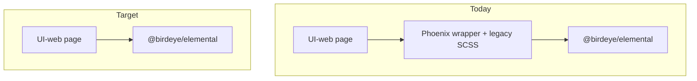

# Phoenix → Elemental component migration (BK-BIRD / BIRD-194995)

**Driver:** [UI-web PR #32637](https://github.com/birdeyeinc/UI-web-2.0/pull/32637) reviewer feedback — Inter / 14px, no Poppins/Roboto, no `elementalFonts` JS import.  
**Policy:** UI-web `prevent-file-updation.js` blocks edits under `src/app/components/Phoenix`; **correct fix is consumer migration**, not hook exceptions.  
**Elemental integration branch:** `BK-BIRD-00000-learning`  
**UI-web branch:** `BK-BIRD-00000-font-size-14px`

---

## Goals

1. UI-web imports **`@birdeye/elemental`** (or app alias to `elemental/core`) — not `components/Phoenix/*` wrappers.
2. Typography from **Elemental SCSS tokens** (`$inter-font`, `$fs14`, `$fwRegular`) — already on Elemental `learning`.
3. Shrink Phoenix tree until hook guard can be relaxed or removed.

---

## Architecture



---

## 19 Phoenix SCSS files (typography PR) — migration class

| Phoenix path | `$poppins` / `$roboto` lines | Elemental counterpart | Migration class | Phase |
|--------------|------------------------------|------------------------|-----------------|-------|
| `NoData/index.scss` | 1 | [`NoData`](../../src/components/NoData) — **already re-export** | **A** Import cutover | **1** |
| `ReviewCard/.../actionBox/index.scss` | 2 | [`ActionBox`](../../src/atoms/ActionBox) — **re-export** | **A** | **1** |
| `GraphTableModule/*.scss` | 2 | [`TableGrid`](../../src/components/TableGrid) + charts in [`GraphTable`](../../src/components/GraphTable) | **B** Table migration | **2** |
| `AnalyticsGraphTableModule/*.scss` | 2 | Same as GraphTable | **B** | **2** |
| `RailNav` | 0 in list | [`RailNav`](../../src/components/RailNav) — **re-export** | Done in Elemental `196309f2` | — |
| `LeftNav/leftNav.scss` | 1 | **No Elemental LeftNav** — app chrome; consider **RailNav** / header patterns | **C** New or defer | **4** |
| `PageHeader/PageHeader.scss` | 1 | **No Elemental PageHeader** — use pattern + atoms | **C** New component | **4** |
| `AccountSwitcher/*.scss` | 5 | **No Elemental AccountSwitcher** | **C** New component | **4** |
| `ReviewCard/ReviewCard.scss` | 1 | Partial Elemental (`actionBox` only); card is Phoenix-only | **C** Large | **4** |
| `ReviewCallOutBanner` | 3 | No direct Elemental | **C** | **4** |
| `ChatEditor/commonWebchat.scss` | 3 | Partial / webchat-specific | **C** | **4** |
| `FaqAIModule`, `FAQFileUploadMatch` | 3 | FAQ modules — evaluate Elemental FAQ patterns | **C** | **4** |
| `ItemSelectionComponent` | 1 | [`ListWithCheckBox`](../../src/components/ListWithCheckBox) partial | **C** | **3** |
| `LocationLevelSelect` | 1 | [`MultiLevelDropdownSelector`](../../src/components/MultiLevelDropdownSelector) | **B/C** | **3** |
| `ResellerGroupsAndBusinesses` | 1 | No Elemental | **C** | **4** |
| `SectionListView`, `SpreadSheetPreview` | 2 | No Elemental | **C** | **4** |

**Classes**

- **A — Re-export elimination:** Phoenix `index` already imports Elemental; delete wrapper SCSS; change imports to `@birdeye/elemental/...` (fixes fonts **without** editing Phoenix).
- **B — Composite migration:** Replace `TableContainer` / Phoenix graph table with **TableGrid** ([`elemental-table-migration`](../src/components/TableGrid/skills/elemental-table-migration/SKILL.md)).
- **C — Port to Elemental:** Build or extend components in `elemental/src/`; export from [`index.js`](../../src/index.js); Storybook story required.
- **D — App-only chrome:** LeftNav / PageHeader may stay in UI-web but must use `$inter-font` only after Elemental tokens are consumed globally.

---

## Phased rollout

### Phase 1 — Import cutover (typography PR unblock)

**Effort:** Low per component; high file count for `NoData`.

| Step | Action |
|------|--------|
| 1.1 | Codemod: `components/Phoenix/NoData` → `@birdeye/elemental/core/components/NoData` (~150 call sites) |
| 1.2 | Codemod: `components/Phoenix/ReviewCard/components/actionBox` → `@birdeye/elemental/core/atoms/ActionBox` |
| 1.3 | Codemod: `components/Phoenix/RailNav` → `@birdeye/elemental/core/components/RailNav` (verify `App/styles.scss` shell) |
| 1.4 | Leave Phoenix folders in place but unused; or delete in follow-up PR with hook approval |
| 1.5 | Bump `@birdeye/elemental` in UI-web `package.json` when learning version published |

**Branch:** `BK-BIRD-00000-font-size-14px` (UI-web) + Elemental release tag.

**Validates #32637 comments:** #13 (no elementalFonts), #14 (inter at Elemental source), RailNav #32637 cross-check.

---

### Phase 2 — TableContainer → TableGrid

**Effort:** Medium–high; use migration skill.

| Step | Action |
|------|--------|
| 2.1 | Inventory `components/Phoenix/GraphTableModule/TableContainer` imports (~100 files) |
| 2.2 | Pilot one module (e.g. `searchAI/prompts` table) on **TableGrid** |
| 2.3 | Move chart font rules from `GraphTableModule.scss` / `Charts.scss` into Elemental `GraphTable` tokens (`$inter-font`) |
| 2.4 | Repeat by product vertical; remove Phoenix GraphTableModule when zero imports |

**References:** [`elemental-table-migration/SKILL.md`](../src/components/TableGrid/skills/elemental-table-migration/SKILL.md), [`Documentation.md`](../src/components/TableGrid/Documentation.md).

---

### Phase 3 — Medium composites

| Component | Elemental target | Notes |
|-----------|------------------|-------|
| `ItemSelectionComponent` | `ListWithCheckBox` / new selector | Assess API parity |
| `LocationLevelSelect` | `MultiLevelDropdownSelector` | Filter v3 modules |
| `AnalyticsGraphTableModule` | `GraphTable` + `TableGrid` | Same as Phase 2 |

---

### Phase 4 — Net-new Elemental components

Build in **Elemental** on `BK-BIRD-00000-<slug>` branches; merge to `learning`; consume from UI-web.

| Component | Priority | Suggested slug |
|-----------|----------|----------------|
| `PageHeader` | High (many pages) | `BK-BIRD-00000-page-header` |
| `AccountSwitcher` | High (header) | `BK-BIRD-00000-account-switcher` |
| `ReviewCard` (shell) | Medium | `BK-BIRD-00000-review-card` |
| `LeftNav` | Medium — overlap with L1 strip / RailNav | Align with product chrome team |
| `ReviewCallOutBanner`, `ChatEditor`, FAQ modules | Lower | Per vertical |

**Per component checklist (Elemental):**

1. Folder under `src/components/` or `src/atoms/`
2. `*.module.scss` using `$inter-font`, `$fs*`, `$fwRegular` / `$fwMedium` only
3. Storybook story
4. Export in [`src/index.js`](../../src/index.js)
5. README row under **BK-BIRD-00000 pushed changes**

---

### Phase 5 — Policy / tooling

| Step | Action |
|------|--------|
| 5.1 | When Phoenix import count = 0, remove `src/app/components/Phoenix` from `prevent-file-updation.js` |
| 5.2 | ESLint rule: forbid `from "components/Phoenix/` in new code |
| 5.3 | Storybook MCP / product-pattern docs: map old Phoenix paths → Elemental (see [`plan/storybook-mcp-architecture.md`](storybook-mcp-architecture.md)) |

---

## UI-web import codemod (Phase 1 example)

```bash
# Run from UI-web-2.0 root on BK-BIRD-00000-font-size-14px
rg -l 'components/Phoenix/NoData' src \
  | xargs sed -i '' 's|components/Phoenix/NoData|@birdeye/elemental/core/components/NoData|g'
```

Repeat for RailNav, ActionBox, Loader, SearchFilter, etc. (see re-export list in repo grep `from "@birdeye/elemental` under `Phoenix/**/index.*`).

---

## Re-export catalog (migrate Phase 1)

Phoenix folders that **already** re-export Elemental (grep May 2026):

`RailNav`, `NoData`, `Loader`, `Search`, `SearchFilter`, `Tag`, `TabHeader`, `ToggleTabs`, `CountryPhoneInput`, `TimePeriodFilter`, `RatingStar`, `SortableList`, `MediaCollage`, `ToggleableMenu`, `MultiLevelDropdownSelector`, `ChartVisualisationDropdown`, `ChromePickerInput`, `TableGridColumnProvider`, `ListWithCheckBox`, `ImageViewWithModal`, `MapView`, `SentimentScore` / `InboxSentimentScore`, `GraphTableModule` (partial), `AnalyticsGraphTableModule` (partial), `ReviewCard/.../actionBox`, and others.

**Policy:** Prefer **direct Elemental import** in pages; Phoenix folder becomes dead code → delete in batch PR.

---

## Typography alignment (done / pending)

| Item | Owner | Status |
|------|-------|--------|
| RailNav `data-title-tier` + `$fs14` | Elemental | **Done** `196309f2` |
| No `fonts.js` in Emotion `variable.js` | UI-web `ab7322c` | **Done** |
| `App/styles.scss` rail shell (no 16px lock) | UI-web `ab7322c` | **Done** |
| Phoenix SCSS `$poppins-font` lines | UI-web | **Pending** — resolved by Phase 1–4, not sed in Phoenix |
| Bump `@birdeye/elemental` | UI-web | **Pending** after publish |

---

## Recommended ticket split

| Ticket | Scope | PR target |
|--------|-------|-----------|
| **BIRD-194995-1** | Phase 1 codemod (NoData, RailNav, ActionBox, top re-exports) | UI-web #32637 |
| **BIRD-194995-2** | Phase 2 TableGrid pilot (1 module) | UI-web + Elemental if API gaps |
| **BIRD-194995-3** | Elemental `PageHeader` | Elemental → UI-web |
| **BIRD-194995-4** | Elemental `AccountSwitcher` | Elemental → UI-web |
| **BIRD-194995-5** | ReviewCard / LeftNav assessment | Planning |

---

## Related docs

- [`plan/phoenix-inter-font-hook-approval.md`](phoenix-inter-font-hook-approval.md) — superseded by this plan (hook exception no longer recommended)
- [`src/Docs/pr-32637-alignment-report.md`](../src/Docs/pr-32637-alignment-report.md)
- [`src/Docs/inter-typography-audit.md`](../src/Docs/inter-typography-audit.md)
