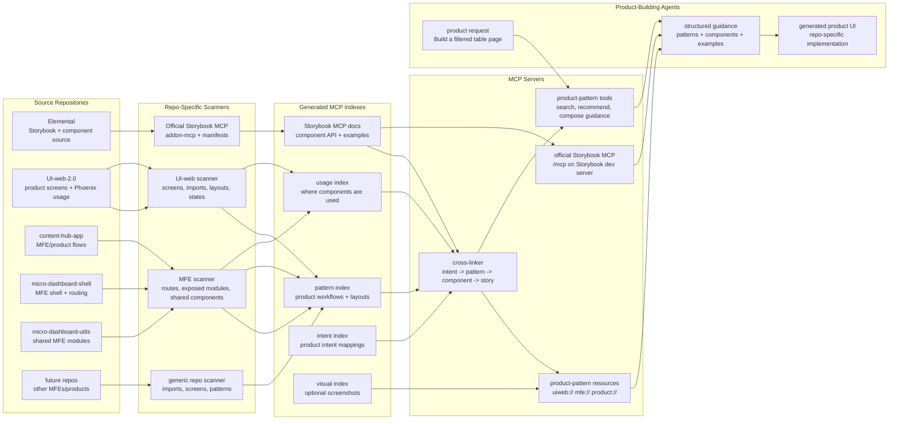
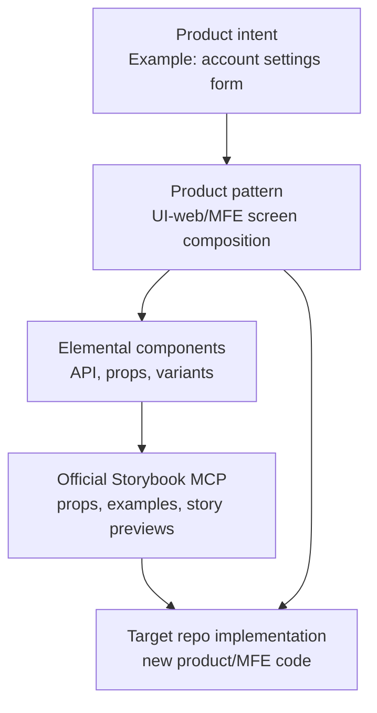
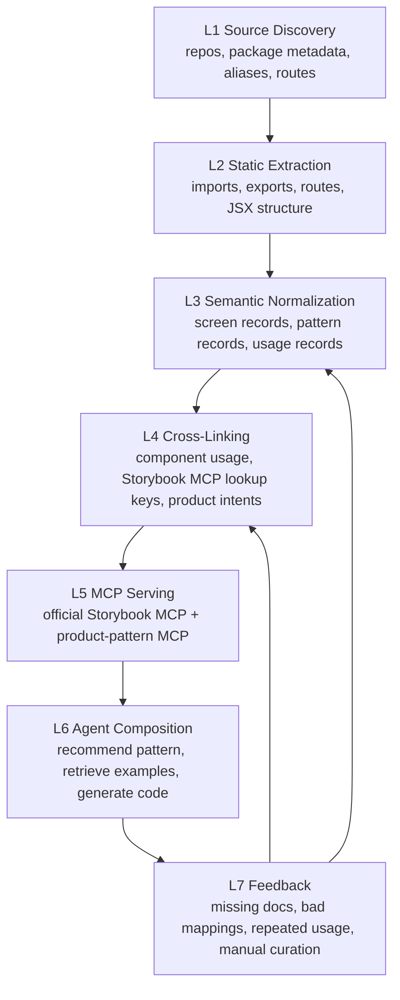
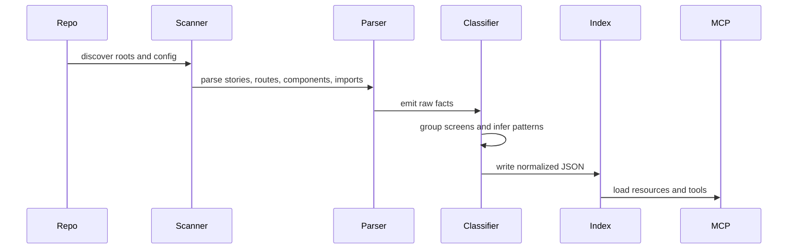
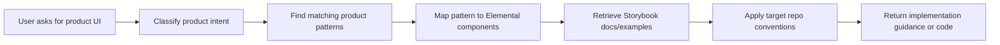

# Storybook And Product Pattern MCP Architecture

## Purpose

Scale product-building guidance across Elemental, UI-web-2.0, MFEs, and future repos by separating official Storybook component knowledge from custom product-pattern knowledge.

Storybook MCP decision:

- Use Storybook's official MCP server through `@storybook/addon-mcp` for Elemental component documentation, story previews, story instructions, and story tests.
- Use custom scanners and a custom product-pattern MCP for UI-web-2.0, MFEs, and future product repos.
- Cross-link product-pattern records to Storybook MCP lookup keys instead of duplicating Storybook docs.

## High-Level Architecture



## Knowledge Boundaries



Elemental remains the component source of truth. Product repos remain the composition source of truth.

## Layered System Design



The product-pattern scanner should be deterministic first, curated second. A product-building agent should be able to trust the MCP because most links come from real source files, real imports, official Storybook MCP documentation, and repeatable classification rules.

## Source Discovery

Each repo starts with a discovery pass.

Inputs:

- repo root
- package manager and workspace metadata
- `package.json`
- TypeScript and Babel aliases
- Storybook config when present
- routing files
- module federation config when present
- source roots such as `src`, `src/app`, `src/components`, `src/pages`, `src/modules`

Outputs:

```json
{
  "repoId": "content-hub-app",
  "root": "/Users/balajikannan/Sites/Source/content-hub-app",
  "kind": "mfe",
  "sourceRoots": ["src"],
  "aliases": {},
  "hasStorybook": false,
  "hasModuleFederation": true,
  "elementalImportCount": 0,
  "routeFiles": [],
  "candidateScreenRoots": []
}
```

This lets new repos connect without changing the MCP server. Only the connector needs to know each repo's filesystem conventions.

## Extraction Pipeline



Raw facts should be small and auditable:

- file path
- import specifier
- imported names
- JSX tags used
- story title
- route path
- folder/domain name
- detected state words
- detected action words

Pattern records should always reference the raw facts that produced them.

## Pattern Detection Rules

Pattern classification should combine signals rather than rely on a single filename.

### List/Table Page

Strong signals:

- uses `TableGrid`, `TableContainer`, or table wrapper components
- includes filters or search components
- includes pagination, infinite scroll, row actions, or bulk actions
- route or folder names include list, table, history, locations, contacts, listings, reviews

Typical components:

- `TableGrid`
- `SearchFilter`
- `SingleSelect`
- `TimePeriod`
- `Button`
- `NoData`
- `LoaderBox`

### Dashboard Page

Strong signals:

- card/grid metric layout
- chart components
- date range controls
- comparison or trend language
- route or folder names include dashboard, home, overview, insights, analytics

Typical components:

- dashboard block patterns
- graph/chart components
- `TimePeriod`
- `NoData`
- loaders and shimmer states

### Settings/Form Page

Strong signals:

- repeated form inputs
- save/cancel/apply actions
- validation/error components
- route or folder names include setup, settings, config, add, edit, create

Typical components:

- `FormInput`
- `SingleSelect`
- `Multiselect`
- `TextAreaCounter`
- `Button`
- `Modal`

### Drawer Flow

Strong signals:

- side drawer components or drawer style imports
- create/edit/detail quick-view naming
- overlay/backdrop usage
- submit/cancel footer actions

Typical components:

- `SideDrawer`
- `CommonSideDrawer`
- form components
- `Button`
- loaders

### Modal Flow

Strong signals:

- `Modal`, `ConfirmationModal`, preview modal, delete confirmation
- confirm/cancel action pairs
- warning/error copy
- close handlers

Typical components:

- `Modal`
- `ConfirmationModal`
- `Button`
- `InfoComponent`

### Navigation Shell

Strong signals:

- left nav, rail nav, L2/L3 menu wrappers
- route layout components
- page header or subheader composition

Typical components:

- `RailNav`
- `TabHeader`
- breadcrumbs
- page header wrappers

## Confidence Scoring

Every inferred pattern should include a confidence score.

```json
{
  "patternId": "ui-web/listings/table-wrapper-with-selection",
  "workflow": "list-table-page",
  "confidence": 0.88,
  "signals": {
    "componentImports": 0.35,
    "jsxUsage": 0.25,
    "routeOrFolderName": 0.15,
    "stateAndActionWords": 0.08,
    "repeatedShapeAcrossRepo": 0.05
  }
}
```

Suggested scoring:

- `0.90+`: canonical pattern; safe to recommend first
- `0.70-0.89`: strong example; useful with source references
- `0.50-0.69`: candidate; useful for search but not first-choice recommendation
- below `0.50`: raw usage only; do not present as a recommended pattern

## Cross-Repo Normalization

Different repos will name the same thing differently. Normalize into stable concepts.

Examples:

| Raw usage | Normalized concept |
|---|---|
| `components/Phoenix/Button/Button` | `Button` |
| `@birdeye/elemental/core/atoms/Button` | `Button` |
| `components/SearchFilter` | `SearchFilter` |
| `components/Phoenix/Modal/Modal` | `Modal` |
| `TableContainer` | `LegacyTableContainer` |
| `TableGrid` | `TableGrid` |

Keep both values:

```json
{
  "rawImport": "components/Phoenix/Button/Button",
  "normalizedComponent": "Button",
  "sourceSystem": "phoenix-wrapper",
  "storybookComponentId": "atoms/button"
}
```

This matters because many product repos may still use Phoenix wrappers while Elemental Storybook documents the target component API.

## MFE-Specific Handling

MFEs need a slightly different connector because product boundaries are often exposed through routes or module federation instead of a monolithic app router.

For MFE repos, extract:

- exposed modules
- shell routes
- remote entry config
- public mount points
- shared dependencies
- cross-repo imports
- common wrapper/layout components

MFE pattern records should include host context:

```json
{
  "repoId": "micro-dashboard-shell",
  "kind": "mfe-shell",
  "patternId": "dashboard-shell/route-container",
  "hostContext": {
    "mountType": "shell-route",
    "sharedDependencies": ["react", "@birdeye/elemental"],
    "dependsOn": ["micro-dashboard-utils"]
  }
}
```

## Agent Retrieval Flow



Example:

```text
User: Build a contacts list with filters, bulk actions, and a quick-view drawer.
```

MCP should return:

- matching UI-web contacts/list patterns
- whether the pattern is table/list, drawer flow, or bulk action flow
- Elemental components to use
- Storybook stories for those components
- source files with similar implementations
- caveats for the target repo, such as Phoenix wrapper usage or MFE shell constraints

## Data Freshness And Versioning

Each generated index should include provenance.

```json
{
  "generatedAt": "2026-05-18T00:00:00.000Z",
  "repo": "UI-web-2.0",
  "branch": "feature/example",
  "commit": "abc123",
  "scannerVersion": "0.1.0",
  "schemaVersion": "0.1.0"
}
```

Use this to avoid mixing old product patterns with new Storybook APIs.

## Governance

Not every detected pattern should be promoted to product guidance.

Pattern lifecycle:

```text
raw usage -> candidate pattern -> reviewed pattern -> canonical pattern -> deprecated pattern
```

Rules:

- raw usage can appear in search
- candidate patterns need confidence and source links
- reviewed patterns can be recommended
- canonical patterns can be first-choice guidance
- deprecated patterns should explain the replacement

Manual curation should live in small overlay files, not inside generated indexes:

```text
mcp-index/curation/product-intents.json
mcp-index/curation/canonical-patterns.json
mcp-index/curation/deprecated-patterns.json
```

## Failure Modes

Known risks:

- Phoenix wrappers hide the actual Elemental component relationship.
- Legacy components and target Elemental components may share names but differ in props.
- Storybook examples may be too isolated compared with product composition.
- MFE routes can be invisible without reading shell config.
- Repos may use dynamic imports that basic static scans miss.

Mitigations:

- preserve raw imports and normalized names
- use confidence scores
- include source paths in every MCP answer
- prefer canonical/reviewed patterns for recommendations
- let agents ask for raw usage when canonical guidance is missing

## Repo Connector Contract

Each repo connector should output the same normalized shape so the MCP server does not need repo-specific logic.

```json
{
  "repoId": "ui-web-2.0",
  "repoPath": "/Users/balajikannan/Sites/Source/UI-web-2.0",
  "kind": "product-app",
  "patterns": [],
  "componentUsage": [],
  "routes": [],
  "screens": [],
  "metadata": {
    "framework": "react",
    "usesElemental": true,
    "usesPhoenix": true
  }
}
```

## Pattern Grouping Model

Group patterns by product workflow first, then by domain.

Primary workflow groups:

- list/table pages
- dashboards and metric summaries
- settings/configuration forms
- create/edit drawers
- confirmation and preview modals
- navigation shells and L2/L3 pages
- bulk action flows
- upload/media flows
- inbox/conversation layouts
- workflow/canvas builders
- report/PDF pages

Domain tags:

- reviews
- listings
- contacts
- payments
- appointments
- messenger
- insights
- setup
- workflows
- campaigns
- content hub
- dashboards

## MCP Resource Shape

```text
repo://repos
repo://repos/{repoId}

uiweb://patterns
uiweb://patterns/{patternId}

mfe://patterns
mfe://patterns/{repoId}/{patternId}

product://intents
product://intents/{intentId}
```

Storybook component/docs/story access should come from the official Storybook MCP endpoint, not custom `storybook://` resources.

## MCP Tool Shape

```text
Official Storybook MCP tools:
list-all-documentation
get-documentation
get-documentation-for-story
get-storybook-story-instructions
preview-stories
run-story-tests

Custom product-pattern MCP tools:
search_product_patterns(query, repoId?)
get_product_pattern(patternId)
find_component_usage(componentName, repoId?)
recommend_pattern(productIntent, repoId?)
compose_product_guidance(productIntent, targetRepoId?)
```

## Current Scan Status

This is not a full product-pattern scan yet. Current confirmed local source repos:

- `/Users/balajikannan/Sites/Source/elemental`
- `/Users/balajikannan/Sites/Source/UI-web-2.0`
- `/Users/balajikannan/Sites/Source/content-hub-app`
- `/Users/balajikannan/Sites/Source/micro-dashboard-shell`
- `/Users/balajikannan/Sites/Source/micro-dashboard-utils`

Lightweight scan findings:

- UI-web-2.0 has broad product areas under `src/app/pages`, including insights, home, payments, appointments, messengerV2, listings, contacts, qrcodes, campaignsAI, setup, and workflows.
- UI-web-2.0 has many shared app components under `src/app/components`, including table, filter, form, modal, drawer, navigation, no-data, upload, and Phoenix component wrappers.
- A quick Elemental import scan found 327 UI-web-2.0 source files referencing `@birdeye/elemental` or `elemental/core`.
- A quick Elemental import scan found 86 source files across `content-hub-app`, `micro-dashboard-shell`, and `micro-dashboard-utils` referencing `@birdeye/elemental` or `elemental/core`.

What remains:

- Build the scanner to classify all products and features automatically.
- Group patterns by workflow and domain from real usage rather than manual naming.
- Deduplicate legacy Phoenix wrappers versus direct Elemental usage.
- Generate confidence scores for each pattern based on import evidence, route evidence, and repeated usage.
